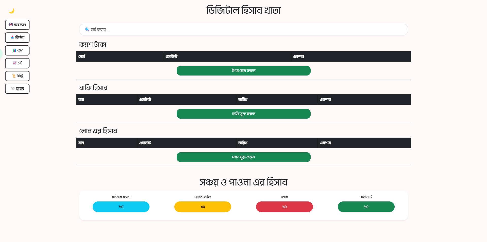
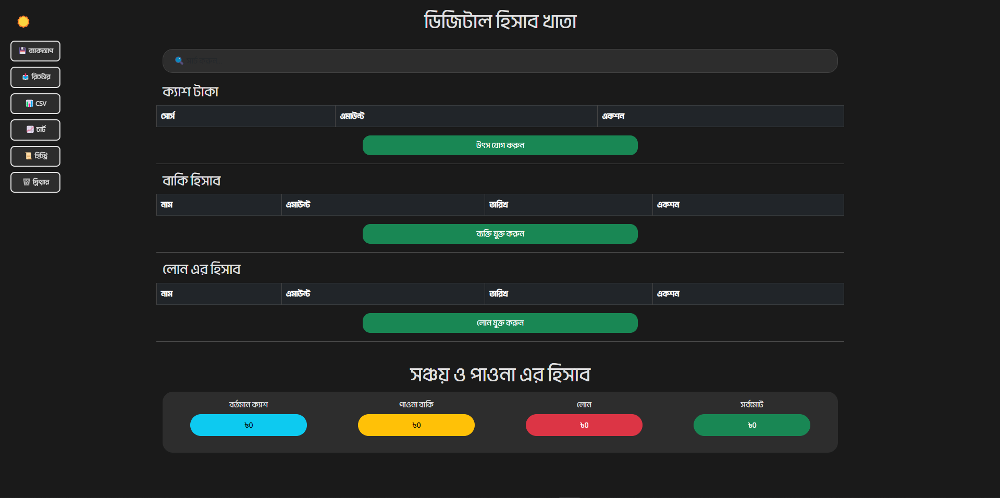
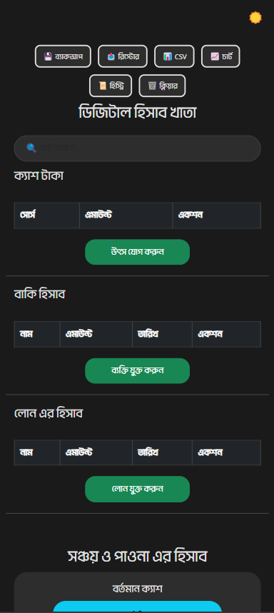

# ডিজিটাল হিসাব খাতা (Digital Accounting Ledger)

A modern, feature-rich Bengali accounting application for managing cash, receivables, and loans. Built with vanilla JavaScript and Bootstrap 5.


## 🌟 Features

### Core Functionality
- ✅ **Cash Management** - Track multiple cash sources with deposit functionality
- ✅ **Due/Receivables Tracking** - Monitor money owed to you by others
- ✅ **Loan Management** - Keep track of loans you need to repay
- ✅ **Real-time Calculations** - Automatic calculation of totals and grand balance
- ✅ **Data Persistence** - All data saved to browser localStorage
- ✅ **Dark/Light Theme** - Toggle between themes with preference saving

### Advanced Features (New in v2.0!)
- 🔍 **Real-time Search** - Search across all tables instantly
- 💾 **Backup & Restore** - Export/import all data as JSON
- 📊 **CSV Export** - Download data in CSV format with Bengali support
- 📈 **Interactive Charts** - Visualize your finances with pie and bar charts
- 📜 **Transaction History** - Complete audit trail of all operations
- 🗑️ **Safe Data Management** - Clear all data with confirmation dialogs

### User Experience
- 📱 **Responsive Design** - Works seamlessly on desktop, tablet, and mobile
- 🎨 **Bengali UI** - Complete Bengali language interface
- 🔔 **Toast Notifications** - Success notifications for data saves
- 💾 **Auto-save** - Automatic saving on every change
- 🕐 **Timestamp Tracking** - Automatic date/time logging for dues and loans
- ⚡ **Fast & Lightweight** - No backend required, runs entirely in browser

## 🚀 Quick Start

### Option 1: Direct Open
Simply open `index.html` in any modern web browser.

### Option 2: Local Server
```bash
# Using Python
python -m http.server 8000

# Using Node.js
npx serve

# Then open http://localhost:8000
```

## 📸 Screenshots

### Light Theme

*Main dashboard showing cash, dues, and loan tracking with summary cards*

### Dark Theme

*Dark mode for comfortable viewing in low-light environments*

### Mobile Responsive


*Fully responsive design that works perfectly on mobile devices*

## 💡 Usage Guide

**📖 For detailed feature documentation, see [FEATURES.md](FEATURES.md)**

### Action Buttons Panel (Left Side)
- **💾 ব্যাকআপ** - Export all data as JSON file for backup
- **📥 রিস্টোর** - Import previously backed up data
- **📊 CSV** - Download data in CSV format
- **📈 চার্ট** - View interactive charts and visualizations
- **📜 হিস্ট্রি** - See transaction history (last 100 operations)
- **🗑️ ক্লিয়ার** - Clear all data (with confirmation)

### Search Functionality
- Use the search bar at the top to filter entries across all tables
- Search works in real-time as you type
- Searches names, sources, and amounts

### Managing Cash (ক্যাশ টাকা)
1. Click **"উৎস যোগ করুন"** to add a new cash source
2. Enter the source name and amount
3. Use **"ডিপোজিট"** to add more money to a source
4. Use **"ডিলিট"** to remove a cash source

### Tracking Receivables (বাকি হিসাব)
1. Click **"ব্যক্তি যুক্ত করুন"** to add a person who owes you
2. Enter their name and the amount owed
3. Edit details directly in the table
4. Delete when the debt is cleared

### Managing Loans (লোন এর হিসাব)
1. Click **"লোন যুক্ত করুন"** to add a loan
2. Enter the lender name and loan amount
3. Track all your outstanding loans
4. Delete when loans are repaid

### Theme Switching
- Click the 🌙 (moon) icon in the top-left to switch to dark mode
- Click the ☀️ (sun) icon to switch back to light mode
- Your preference is automatically saved

## 🧮 Balance Calculation

The grand total is calculated as:
```
সর্বমোট = বর্তমান ক্যাশ + পাওনা বাকি - লোন
Grand Total = Current Cash + Receivables - Loans
```

## 🛠️ Technical Stack

- **HTML5** - Semantic markup
- **CSS3** - Custom styles with dark theme support
- **JavaScript (ES6+)** - Vanilla JS, no frameworks
- **Bootstrap 5.3** - Responsive grid and components
- **SweetAlert2** - Beautiful popup dialogs
- **Chart.js 4.4** - Interactive data visualizations
- **LocalStorage API** - Client-side data persistence

## 📁 Project Structure

```
HishabKhata/
├── index.html                      # Main application file
├── Li Ador Noirrit Regular.ttf     # Bengali font
├── README.md                       # This file
└── screenshots/                    # Application screenshots
    ├── light-theme.png
    ├── dark-theme.png
    └── mobile-view.png
```

## 🔧 Customization

### Changing Colors
Edit the CSS variables in the `<style>` section:
```css
/* Light theme background */
body {
  background-color: #fff9f9;
}

/* Dark theme background */
body.dark-theme {
  background-color: #1a1a1a;
}
```

### Modifying Button Styles
```css
.rounded-button {
  border-radius: 15px; /* Adjust for more/less rounding */
}
```

## 📋 To-Do / Future Enhancements

See [TODO.md](TODO.md) for the complete roadmap.

### Recently Completed ✅
- Data Backup/Restore (JSON export/import)
- CSV Export with Bengali support
- Real-time Search functionality
- Transaction History tracking
- Interactive Charts (Pie & Bar)

### High Priority Next Steps
- [ ] PDF Export with Bengali fonts
- [ ] Date range filtering
- [ ] Payment reminders with notifications
- [ ] Partial payment tracking
- [ ] Interest calculation for loans

## 🐛 Known Issues

- None currently reported

## 🤝 Contributing

Contributions are welcome! Feel free to:
1. Fork the repository
2. Create a feature branch (`git checkout -b feature/AmazingFeature`)
3. Commit your changes (`git commit -m 'Add some AmazingFeature'`)
4. Push to the branch (`git push origin feature/AmazingFeature`)
5. Open a Pull Request

## 📄 License

This project is open source and available under the [MIT License](LICENSE).

## 👤 Author

**Sadman-11**
- GitHub: [@Sadman-11](https://github.com/Sadman-11)

## 🙏 Acknowledgments

- Bootstrap team for the excellent CSS framework
- SweetAlert2 for beautiful popups
- Li Ador font for Bengali typography
- VScode Copilot for this cool readme

## 📞 Support

If you encounter any issues or have questions:
1. Check the existing issues on GitHub
2. Create a new issue with details
3. Contact the maintainer

---

**Made with ❤️ for my personal use!! feel free to use it for yourself too**
